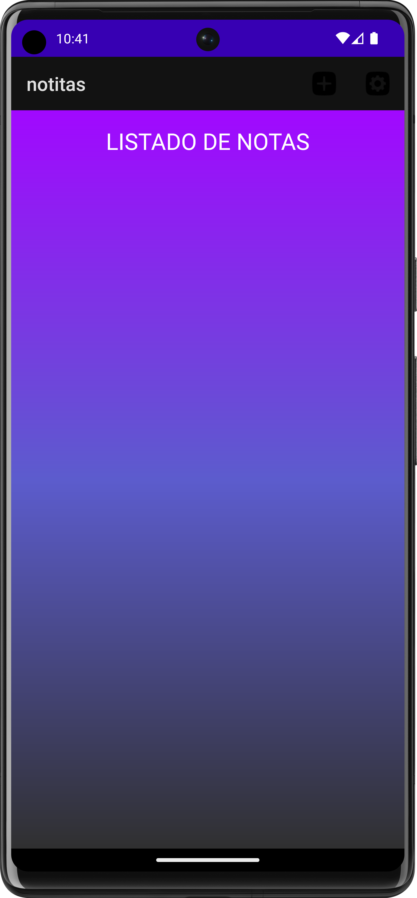
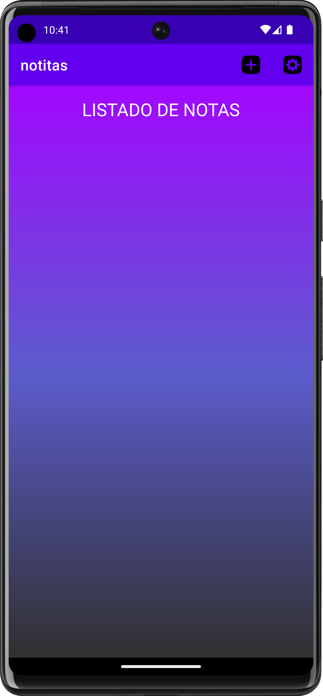

<div align="center">
  
</div>

# Notes App

<div align="center">
<a href='https://github.com/diegantos/Notes-App-android-studio/releases/latest'></a>
</div>

## About the project

This is a simple notes app built with Java.

## Screenshots

<div align="center">


</div>

## Installation

If you want to build it yourself, follow the steps below.

1. Clone the repo

   ```sh
   git clone https://github.com/diegantos/Notes-App-android-studio.git
   ```

2. Open in Android Studio
3. Run on emulator or device
